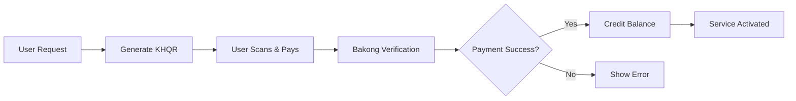

<div align="center">
  <table style="border: none; background: transparent; width: auto; margin: 0 auto;">
    <tr style="border: none; background: transparent;">
      <td style="border: none; background: transparent; padding: 0 20px;">
        <a href="https://laravel.com" target="_blank">
          
        </a>
      </td>
      <td style="border: none; background: transparent; font-size: 48px; font-weight: bold; color: #2d3748;">+</td>
      <td style="border: none; background: transparent; padding: 0 20px;">
        <a href="https://www.bakong.nbc.gov.kh/" target="_blank">
          
        </a>
      </td>
    </tr>
  </table>

  # 💎 SaleFacebook - KHQR Top-up System

  <p align="center">
    <strong>Premium Facebook Service Payments & Balance Top-ups</strong><br>
    <em>Powered by Bakong KHQR (KHR) | Real-time Payment Verification</em>
  </p>

  <p align="center">
    <a href="#"></a>
    <a href="#"></a>
    <a href="#"></a>
    <a href="#"></a>
    <a href="#"></a>
  </p>

  <p align="center">
    <b>Built with precision by</b> <a href="https://github.com/SereyodamChek">Sereyodam</a>
  </p>
</div>

---

## 📌 About This Project

**SaleFacebook** is a premium Laravel application engineered to streamline **Facebook service payments and balance top-ups** utilizing **Bakong KHQR (KHR only)**. This project showcases a robust, production-ready payment flow where users can seamlessly top up balances, with services processing instantly after successful KHQR payment verification.

---

## ✨ Key Features

| Feature | Description |
|---------|-------------|
| 💳 **Bakong KHQR Integration** | Seamless top-up system exclusively for KHR currency |
| 🔄 **Real-time Payment Verification** | Instant transaction confirmation via Bakong API |
| ⚡ **Optimized Architecture** | Clean, maintainable routing and backend logic |
| 🧾 **Transaction Flow** | Complete verification pipeline for balance top-ups |
| 🚀 **Deployment Ready** | Pre-configured for Vercel and production environments |

---

## 🛠️ Technology Stack

<div align="center">
  
| Category | Technology |
|----------|------------|
| **Backend Framework** | Laravel (PHP) |
| **Frontend** | Blade Templates + Vite |
| **Payment Gateway** | Bakong KHQR API |
| **Build Tool** | Vite |
| **Environment** | PHP 8.2+ |

</div>

---

## 📂 Project Architecture

```
📦 SaleFacebook
├── 📁 app/           → Application logic & Controllers
├── 📁 routes/        → Web & API routes
├── 📁 resources/     → Blade views & Frontend assets
├── 📁 config/        → App configuration
├── 📁 database/      → Migrations & Seeders
├── 📁 public/        → Public entry point
├── 📁 storage/       → Cache, logs, uploads
└── 📁 tests/         → Unit & Feature tests
```

---

## ⚙️ Quick Setup

### 1️⃣ Clone Repository
```bash
git clone https://github.com/YOUR_USERNAME/SaleFacebook.git
cd SaleFacebook
```

### 2️⃣ Install Dependencies
```bash
composer install
npm install
npm run build
```

### 3️⃣ Environment Configuration
```bash
cp .env.example .env
php artisan key:generate
```

### 4️⃣ Configure `.env` (Critical)
```env
APP_NAME="SaleFacebook"
APP_URL=http://localhost:8000

# Bakong KHQR Configuration
BAKONG_TOKEN=your_bakong_token_here
BAKONG_ACCOUNT=your_account@wing
```

### 5️⃣ Run Development Server
```bash
php artisan serve
```

**Open:** [http://127.0.0.1:8000](http://127.0.0.1:8000)

---

## 🔄 Payment Flow



---

## 🚀 Roadmap

- [ ] 🔐 User Authentication System
- [ ] 📊 Admin Dashboard with Analytics
- [ ] 🧾 Detailed Transaction History
- [ ] 💳 Multi-currency & Payment Options
- [ ] 📡 RESTful API for Automation

---

## ⚠️ Important Notes

> **Demo / Development Project** — This application demonstrates payment flow and backend logic. KHQR supports **KHR currency only** at this time.

---

## 📫 Connect

<div align="center">
  
| Platform | Link |
|----------|------|
| **GitHub** | [@SereyodamChek](https://github.com/SereyodamChek) |
| **Email** | [sereyodamc011@gmail.com](mailto:sereyodamc011@gmail.com) |

</div>

---

<div align="center">
  <sub>⭐ Building real-world fintech solutions with Cambodian payment systems. ⭐</sub>
</div>
```
